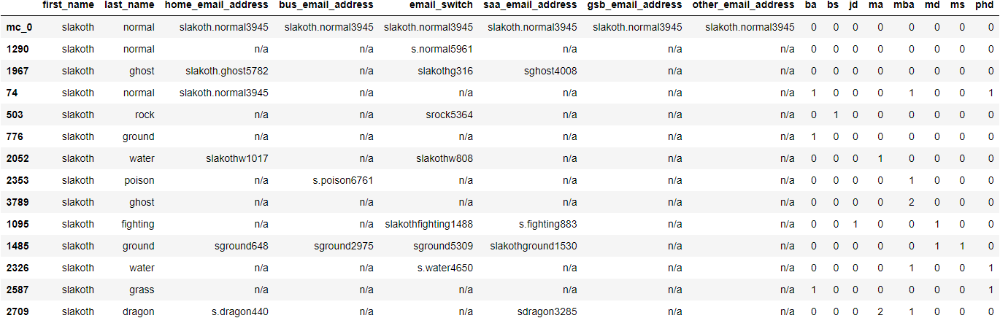
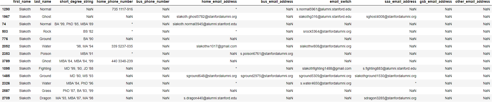

# Database Matching System

<div>

</div>

Authors: 

- Saad Saeed [Github](https://github.com/ssaeed85) | [LinkedIn](https://www.linkedin.com/in/saadsaeed85/)
- Zach Rauch [Github](https://github.com/ZachRauch) | [LinkedIn](https://www.linkedin.com/in/zach-rauch/)
- Hanis Zulmuthi [Github](https://github.com/hanis-z) | [LinkedIn](https://www.linkedin.com/in/hanis-zulmuthi/)

- Xiaohua Su [Github](https://github.com/xiaohua-su) | [LinkedIn](https://www.linkedin.com/in/xiaohua-su/)
# Overview
Nonprofit organizations want to be able to bring new members and retain them.It is vital for organizations to keep in touch with its members who are the foundation to their networks through communications about events or news. Without any method of communication, members are
no longer in touch with the organization, and its activities and are considered 'lost'. A common issue that some organizations may have is that the email provided to the organization as the main means of communication may no longer work or gets bounced once the individual graduates from said institution such as colleges, and or bootcamp. Usually, an individual might forget about updating it before they are far away. As such updating the contact method is critical to keep them in the network. Overtime, this 'lost' member issue will get larger and larger for the organization.

The purpose of this project is to help Stanford Pride address such an issue. Stanford Pride currently has ~5000 members in their database. Unfortunately, Stanford Pride has lost contact with a small portion of its member. One way Stanford Pride recognizes that it has lost contact with a member that has not chosen to opt-out of newsletter is that the newsletters was bounced. According to Stanford Pride, their members are not all using the same platform. Some chose to have subscribed to either only emails, others are only on their Facebook, LinkedIn group and a small minority
interacts with Stanford using multiple platform. As such, Stanford Pride hopes to be able to rectify the issue of lost members by
updating the individual's contact information in order to bring/keep them in the network once again.

Our goal for this project is to help Stanford Pride be able to update this information in a more efficient way. We improved the efficiency by using a cosine similar model to provide a list of individuals from the Stanford Pride database with the individual from their Mailchimp database. This way, the chair in-charge of updating their database does not need to look up multiple potential people on their Stanford Database before deciding if they are the same individual. They now have a list of potential matches with information about them to compare against.

From Stanford Pride:
> A nonprofit organization, such as Stanford Pride, strives by attracting and retaining members.
> It is vital for the organization to stay in touch with its members.
> The main means to achieve this is the sending of newsletters via e-mail.
> Members are not likely to keep informed of the organization’s activity on their own. We only stay in their minds by regularly pushing news out to them.
Members do not always subscribe to other sources of information about the organization’s activities.
> For example, Stanford Pride has approximately 4,400 members in its database, out of which about 3,700 currently have valid e-mail addresses.
> Only 1,600 are part of our Facebook group, and 400 in our LinkedIn group.
> Therefore, our monthly e-mail newsletter is our sole means to reach about 2,100 members – almost half of our total membership.

# Methodology
In order to be able to tackle this issue, we received a database of their mailchimp and Stanford Pride.
Due to the sensitive information in the data, we only received a csv file and an Excel file that contained
the raw data's column names. From there, a fake dataset was created for them. In the datasets, we included some potential issues discussed as well as add some potential issues that we believe may appear down the line.How the fake dataset was created can be found [here](https://github.com/ssaeed85/Equalithon-team6/blob/main/FakeDataset.ipynb). Only the columns that had a match in the Mailchimp dataset were filled.

Using the fake datasets, we decided to use cosine similarity to create a list of individuals that matched on the first name. A score of how similar all the records in the Stanford Pride database is produced out of the cosine model that will then be used to sort the list.
# Results
Our returned matches are saved in two forms. One is called cosine_sim_results that can be called and the other is
called SAA query results.
In the cosine version, only the matching information found on the Mailchimp can be found on this table. The SAA version
returns all the information that is found on the SAA original dataset. This dataset contains more information as such it
is subsetted here and in the app to relevant information.


**cosine sim results**


**Subsetted SAA version result:**


# App
The code for the application can be found on the [app.py](./app.py) file in this GitHub. We decided not to convert this local streamlit app into it's a streamlit website as there is a size limit on streamlit and meant to be a demonstration. Not only that but we are not sure how the Streamlit website deals with data from these applications that do not save data within them. This would be another potential investigation point, but it would be much better if Stanford Pride can use a API call system application to feed in the information. This app as is would require the individual have csv and Excel files with sensitive information downloaded locally and would introduce more potential points of data breach.

# Next Steps
- The model can be further optimized and tuned to account for the rare issues that arises from the datasets. For example, adding weights to feature that tend to be better indicators to a members' identity than others. In addition, there are some features that are good indicators when they hold specific values. Exploring weighted cosine similarities may prove beneficial to the model's performance.


- Use the Salesforce information through its API. This filtering and model only used the dataset from Mailchimp which is in sync with the Salesforce database. Unfortunately, the Mailchimp data has very limited information compared to its mother database Salesforce as such the information used to match is very limited. As such, being able to potentially match the individual on the bounced Mailchimp data to the Salesforce to increase the potential areas of matches will likely yield better matches to the Stanford Database.


- Further investigation of Mailchimp and Salesforce platform. Due to time restraint, we were unable to look into how both of these platforms integrate with each other and work. We would want to investigate if there is a way for us do an API call from Salesforce to Mailchimp. This way, we can potentially get a list of bounced individuals from Mailchimp in Salesforce and implement our model there as there is developer console available on Salesforce.


- Take a proactive approach. We would suggest using the salesforce dataset to check for recent grads or to-be-graduates to reach out before they lose their student emails and ask for updated contact information and their subsequent plans after graduation. It would be easier to update records proactively when we still have accurate contact information. For subsequent plans after graduation, this would be to keeping location information of members to more accurately send regional events and functions.

# Running the Notebooks and app
In the GitHub, a copy of the environment use to run this notebook and the fake dataset notebook can be found. We have provided the [windows environment](./Environment_windows.yml) and [MAC environment](./Environment_mac.yml) versions.

# Repository Structure
```
├── .streamlit
├── Images
├── data
├── src
├── workspace
├── .gitignore
├── Environment_mac.yml
├── Environment_windows.yml
├── FakeDataset.ipynb
├── README.md
├── Stanford Pride Matching System.ipynb
└── app.py


```
